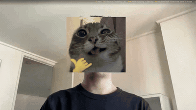
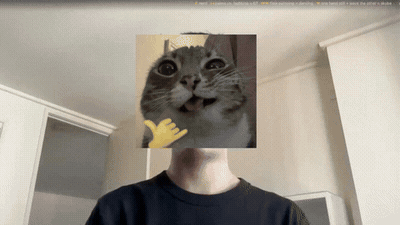
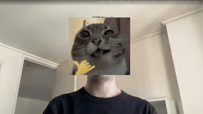
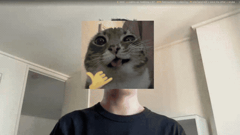

# 67

Webcam meme cam. Throw a hand gesture, get the matching cat.

Runs entirely in the browser — MediaPipe Hands via WASM. Your camera feed never
leaves your device, so there's nothing to host but static files.

Three of the four are *motion* gestures — held still they do nothing, because
the app watches a hand travel back and forth, not just its finger pose. They are
told apart by axis: 67 and dancing move vertically (open hands vs fists), skuba
moves horizontally.

## The gestures

### ☝️ nerd cat — index finger up

The only one that needs no movement. Index up, everything else curled.



### 🙌 67 cat — both palms to the sky, bobbing

Palms up, bobbing vertically.



### 🤛🤜 dancing cat — two fists pumping

Both fists, pumping up and down.



### 🤝 skuba cat — one hand still, wave the other

Both hands up. Hold one still and wave the other palm side to side.



## Run it

```
python3 -m http.server 8067
```

Then open **http://localhost:8067** — not the `http://0.0.0.0:8067` the server
prints, and not your LAN IP. Browsers only hand out a camera on a secure origin:
`https://`, `localhost`, or `127.0.0.1`.

To try it on your phone, deploy it (below) — you need real HTTPS for that.

## Deploy

Push the repo and point any static host at the root (Cloudflare Pages, GitHub
Pages, Vercel). No build step, no server.

## The meme files

The four cats are looping MP4s in `memes/`, played by a single `<video>` with
`muted loop playsinline` — `muted` and `playsinline` are what let iOS Safari
autoplay them inline. They were GIFs originally and totalled 28.5 MB, which
every visitor downloaded before seeing anything; the same clips are 203 KB.

They render into a fixed box — 400px on desktop, 300px on phones — with
`object-fit: contain`, so all four appear at the same size regardless of source
resolution. To re-encode one:

```
ffmpeg -i in.gif -vf "fps=15,scale=400:-1:flags=lanczos,format=yuv420p" \
  -an -c:v libx264 -crf 30 -pix_fmt yuv420p -movflags +faststart out.mp4
```

The clips under `demo/` are the gesture instructions above. Those stay GIFs on
purpose: GitHub renders a GIF inline in a README and loops it, while a relative
`.mp4` path renders as a bare link.

## Changing gestures

All the logic is `classify()` in [gestures.js](gestures.js) — a lookup from
which fingers are extended to a meme name. Add a case, drop an MP4 in `memes/`,
add it to `MEMES` in `index.html`.

```
node gestures.test.mjs
```
